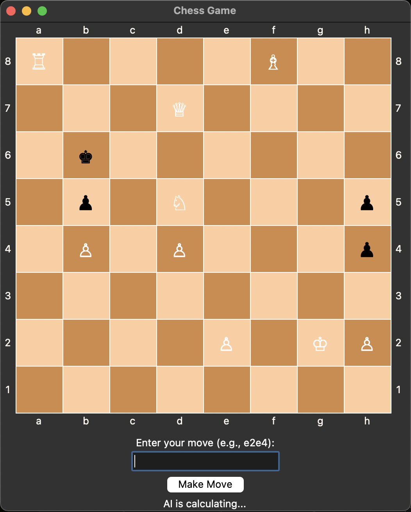

# Chess: Human vs Computer

This game allows users to play against an AI opponent that makes moves based on a minimax algorithm with alpha-beta pruning and a pre-trained convolutional neural network (CNN) model.

## Installation
1. Clone this repository to your local machine.
2. Install dependencies using pip: pip install -r requirements.txt
3. Ensure you have a working version of Stockfish installed on your machine. You may need to modify the path to Stockfish in the code if it's installed in a different location.

## Usage
To run the chess game, execute the ChessCNN.py file. The GUI window will open, allowing you to play against the AI. Enter your move in UCI notation (e.g., e2e4) and click "Make Move" to confirm your move. The AI will then calculate its move and display it on the board. If you would like to create your own dataset and model, remove the `chess_model.h5` and `dataset.npz` files. Then, replace the number in the main method inside of populate_dataset(1000) with the desired amount of board datasets you would like to use.

## Video Demonstration

Click on the thumbnail above to watch the video demonstration of using this program. 
